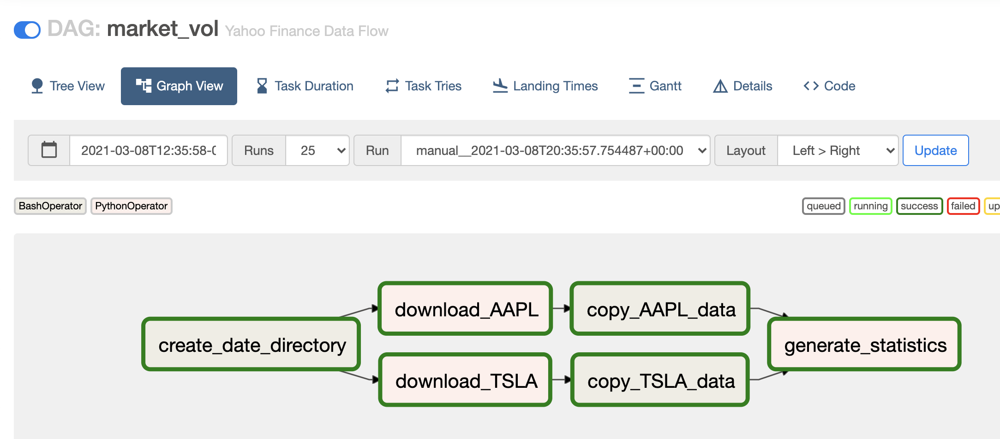

# AIRFLOW PROJECT: STOCK MARKET DATA


## Introduction

>  In this project, we will use Apache Airflow to create a data pipeline to extract online stock market data and deliver analytical results. You’ll use Yahoo Finance as the data source. Yahoo Finance provides intra-day market price details down a one-minute interval. We’ll work with two stock symbols: ***AAPL*** and ***TSLA***.

## HOW WE CREATE  THE DAG

### 1) Importing Necessary Modules
	from datetime import timedelta, datetime
	from airflow import DAG
	from airflow.operators.bash import BashOperator
	from airflow.operators.python import PythonOperator
	import yfinance as yf
	import pandas as pd
	import pendulum

### 2) Define local time and report date range

```python
local_tz = pendulum.timezone('US/Pacific')

# Date range for Yahoo Finance download current day's data
start = datetime.now(tz=local_tz).date() - timedelta(days=0)
end = datetime.now(tz=local_tz).date() - timedelta(days=-1)
```

### 3) Declare default arguments and create DAG instance
```python
# Define dag arguments
default_args = {
    'owner': 'airflow',
    'start_date': datetime.now(tz=local_tz),
    'retries': 1,
    'retry_delay': timedelta(minutes=1),
    'schedule_interval': '0 18 * * 1-5'  # everyday 6 pm, runs once daily on weekdays
}

#  create dag
dag = DAG(
    'market_vol',
    default_args=default_args,
    description='Yahoo Finance Data Flow')
```

### 4) Create required Python functions
```python
# Function to download data from Yahoo Finance
def download_data(*op_args):
    symbol = op_args[0]
    df = yf.download(symbol, start=start, end=end, interval='1m')
    df.to_csv(f"~/airflow/raw_data/{start}/{symbol}_data.csv")
    return


# Function to generate statistics for downloaded csv files
def describe_data(*op_args):
    for symbol in op_args:
        df = pd.read_csv(f'~/airflow/daily_data/{start}/{symbol}_data.csv')
        df.describe().to_csv(f'~/airflow/daily_data/{start}/{symbol}_data_statistics.csv')
    return
```
### 5) Create tasks ###

```python
# Bash operator to create the temporary directories
t0 = BashOperator(
    task_id='create_date_directory',
    bash_command=f'mkdir -p ~/airflow/raw_data/{start} && mkdir -p ~/airflow/daily_data/{start}',
    dag=dag)

# Python operator to download AAPL data
t1 = PythonOperator(
    task_id='download_AAPL',
    python_callable=download_data,
    op_args=['AAPL'],
    dag=dag)

# Python operator to download TSLA data
t2 = PythonOperator(
    task_id='download_TSLA',
    python_callable=download_data,
    op_args=['TSLA'],
    dag=dag)

# Bash operator to copy AAPL data to another directory
t3 = BashOperator(
    task_id='copy_AAPL_data',
    bash_command=f'cp ~/airflow/raw_data/{start}/AAPL_data.csv ~/airflow/daily_data/{start}',
    dag=dag)

# Bash operator to copy TSLA data to another directory
t4 = BashOperator(
    task_id='copy_TSLA_data',
    bash_command=f'cp ~/airflow/raw_data/{start}/TSLA_data.csv ~/airflow/daily_data/{start}',
    dag=dag)

# Python operator to generate AAPL data statistics
t5 = PythonOperator(
    task_id='generate_statistics',
    python_callable=describe_data,
    op_args=['AAPL', 'TSLA'],
    dag=dag)
```

### 6) Define dependencies among tasks

```python
# Define task dependencies
t0 >> [t1, t2]
t1 >> t3
t2 >> t4
[t3, t4] >> t5
```


#### Graph view of a successful run is below:



