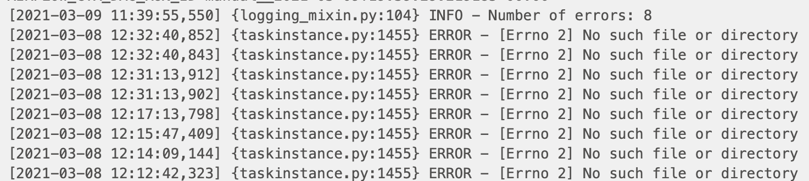

# AIRFLOW PROJECT: LOG ANALYZER


## Introduction

>  Once you we have scheduled a DAG object in Airflow, we need to monitor the status of various jobs in our pipeline on a regular basis. One way to monitor the job status is to analyze the log messages generated from each run. In this project, you will create a log analyzer in Python to monitor the DAG Airflow you set up in the previous mini-project.
>
>  Our log analyzer should show the following information:
>
>  - The total count of error messages
>  - A detailed message regarding each error

## HOW WE CREATE  THE DAG FILE

### 1) Importing Necessary Modules
```python
from datetime import timedelta, datetime
from airflow import DAG
from pathlib import Path
from airflow.operators.python import PythonOperator
import pendulum
```

### 2) Define local time and report date range

```python
local_tz = pendulum.timezone('US/Pacific')

# Date range for Yahoo Finance download current day's data
start = datetime.now(tz=local_tz).date() - timedelta(days=0)
end = datetime.now(tz=local_tz).date() - timedelta(days=-1)
```

### 3) Declare default arguments and create DAG instance
```python
# Define dag arguments
default_args = {
    'owner': 'airflow',
    'start_date': datetime.now(tz=local_tz),
    'retries': 1,
    'retry_delay': timedelta(minutes=1),
    'schedule_interval': '0 20 * * 1-5'  # everyday 8 pm, runs once daily on weekdays after 2 hrs the ETL DAG triggered.
}

#  create dag
dag = DAG(
    'log_analyzer',
    default_args=default_args,
    description='Log Analytics')
```

### 4) Define log directory and create log analysis function
```python
# Define log directory
log_dir = '/Users/muhiddin/airflow/logs/market_vol/'            # Define log directory
file_list_generator = Path(log_dir).rglob('*.log')              # Get all .log file paths
file_list = [str(item) for item in list(file_list_generator)]   # Convert generator to list


# Function to read and parse log files
def analyze_file(*op_args):
    list_of_file = op_args[0]
    count_of_error = 0
    list_of_errors = []
    for file_dir in list_of_file:
        with open(file_dir, 'r') as file:
            for line in file.readlines():
                if 'ERROR' in line.split(' '):
                    count_of_error += 1                               # Increment the count for each error line
                    list_of_errors.append(line.split('\'')[0][:-2])   # Get specific part of the error line

    # Reverse the list so that we can see the most recent records first
    list_of_errors = sorted(list_of_errors, reverse=True, key=lambda x: x.split(']')[0])

    # Print number of errors and error messages
    return print(f"Number of errors: {count_of_error}" + "\n" + '\n'.join(list_of_errors))


```
### 5) Create the task ###

```python
# Python operator to call analyze_file function
t1 = PythonOperator(
    task_id='analyze_log_files',
    python_callable=analyze_file,
    op_args=[file_list],
    dag=dag)
```


#### Output of a successful run is below:



