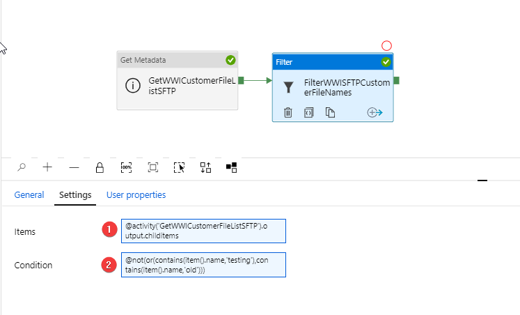
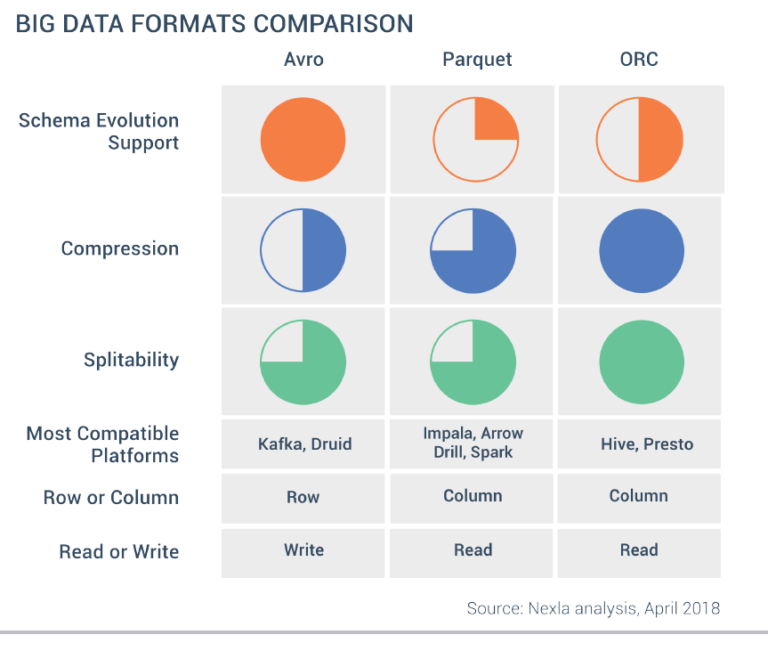

# AZURE DATA FACTORY: HANDS-ON LABS EVALUATION QUESTIONS

<kbd>  </kbd>

## Introduction

>  In this project, I have deployed an End-to-End Azure ELT solution. I have used Azure Data Factory and Mapping Dataflows to perform Extract Load Transform (ELT) using Azure Blob storage and Azure SQL DB.

#### QUESTION 1: Why should one use Azure Key Vault when working in the Azure environment? What are the pros and cons? What are the alternatives? ####

Azure Key Vault encrypts keys and small secrets like passwords that use keys stored in hardware security modules (HSMs) and we don’t need to provision, configure, patch, and maintain HSMs and key management software. Key Vault quickly scales to meet the cryptographic needs of cloud applications and match peak demand, without the cost of deploying dedicated HSMs. One of the cons may be the extra work needed to create linked services and to configure and store the secrets in the Key Vault. Storing keys in a file in the storage or database is an extremely unsecure alternative. 

#### QUESTION 2: How do you achieve loop functionality within a Azure Data Factory pipeline? Why would you need to use this functionality in a data pipeline? ####

We can use ForEach loop action to run specific tasks repetitively based on a desired set of variables like dates or filenames to automate some pipeline executions or tasks instead of manual runs / triggers.

#### QUESTION 3: What are expressions in Azure Data Factory? How are they helpful when designing a data pipeline? Please explain with an example. ####

Expressions are JSON based formulas, which allows for the modification of variables or any other parameters within a pipeline, action, or connection in ADF. For example, when we create parameters, instead of static values we can use expressions to use output values of previos steps or pipeline parameters. For example, I have extracted file names using Get Metadata action and conveyed them into a filter process with expressions.

 <kbd>  </kbd>

#### QUESTION 4: What are the pros and cons of parametrizing a dataset’s activity in Azure Data Factory? ####

Parameterization can save a tremendous amount of time and allow for a much more flexible Extract, Transform, Load (ETL) solution, which will dramatically reduce the cost of solution maintenance and speed up the implementation of new features into existing pipelines. These gains are because parameterization minimizes the amount of hard coding and increases the number of reusable objects and processes in a solution. One disadvantage mightbe that over-engineering parameters to create a dynamic pipeline may lead to a very complex solution which may become very difficult even for the owner to understand.

#### QUESTION 5: What are the different supported file formats and compression codecs in Azure Data Factory? When will you use a Parquet file over an ORC file? Why would you choose an AVRO file format over a Parquet file format? ####

- Avro format
- Binary format
- Delimited text format
- Excel format
- JSON format
- ORC format
- Parquet format
- XML format

Figure below is good guide to select which format based on the nature of the job on the files:

 <kbd>  </kbd>