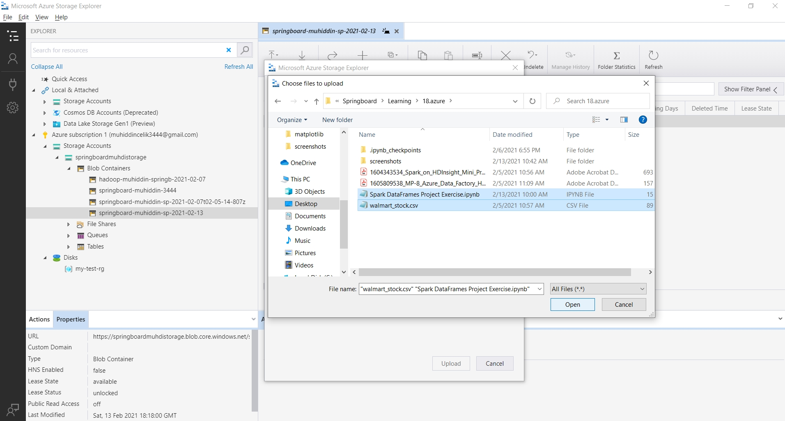

# AZURE HDInsight: DATA ANALYTICS ON AZURE SPARK CLUSTER

## Introduction

>  In this project, I have tried to get hands-on experience with Apache Spark for Azure HDInsight. After provisioning a Spark cluster, I have used the Microsoft Azure Storage Explorer to upload the Jupyter Notebook exercise file and the stock file (csv) to the cluster. Then I have used the notebook to explore and analyze [Walmart stock data](data/walmart_stock.csv). 

### STEP 1: Creating HDInsight Spark Cluster on Azure

<kbd>  </kbd>
<kbd>  </kbd>
<kbd>  </kbd>

### STEP 2: Uploading Project Files to Spark Cluster's Storage Container using Azure Storage Explorer

<kbd>  </kbd>
<kbd>  </kbd>

### STEP 3: Open Jupyter Notebook in the Spark Cluster on Azure

<kbd>  </kbd>
<kbd>  </kbd>
<kbd>  </kbd>

### STEP 4: Download the Final Jupyter Notebook file using Azure Storage Explorer
[Here](Spark_DataFrames_Project_Exercise.ipynb) is the final version of the Jupyter Notebook file.

<kbd>  </kbd>

### STEP 5: Deleting the HDInsight Spark Cluster

<kbd>  </kbd>