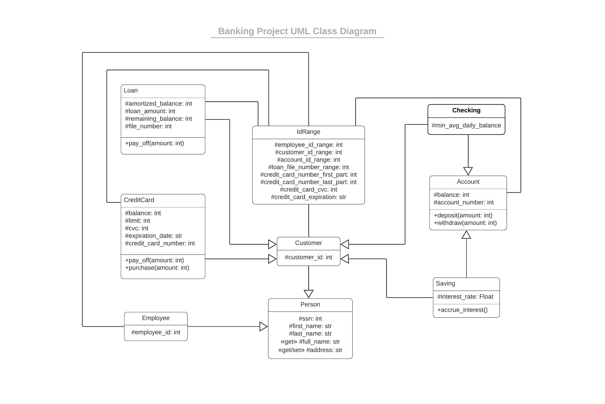
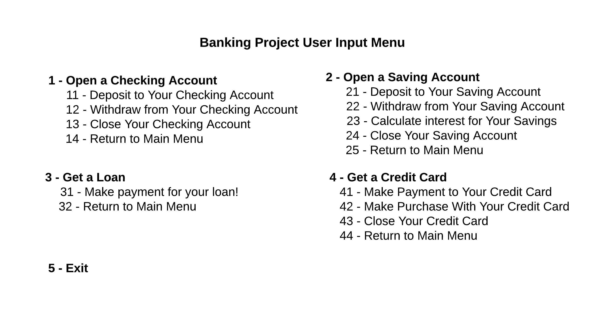

# OOP Programming: Bank Project

## Introduction

> This program mimics the core services of a bank: Checking Accounts, Saving Accounts, Credit Cards and Loans. For each of these services program captures the data and records to csv files in **[data](data)** folder.

## Part One: UML

UML Class Diagram of the program resides in **[docs](docs)** folder, and it is also shown below:

## Part Two: How to Create Class Instances    

Examples to show initializing class objects and using methods if applicable.
### 1) Employee Instance ###  

### 2) Checking Account Instance ###  

### 3) Saving Account Instance ###  

### 4) Credit Card Instance ### 

**Creating a credit card instance:**

***credit_card_instance = CreditCard(ssn: int, first_name: str, last_name: str, address: str, limit: int)***

**Note:** SSN argument should be an int with 9 digits.

After credit card instance created, the data about the credit card is saved to **[credit_card.csv](data/credit_card.csv)**.
Example entries for credit_card.csv are shown below:

| index | ssn       | credit_card_number |  limit |  expiration_date |  cvc |
|-------|-----------|--------------------|--------|------------------|------|
| 0     | 112233445 | 4234567890125150   | 1000   | 12-23            | 124  |
| 1     | 123412345 | 4234567890126800   | 900    | 12-23            | 168  |

**Calling credit card methods on credit_card_instance:**

***credit_card_instance.pay_off(amount: Int)*** (Decreases credit_card_instance's balance attribute by 'amount'.) 

***credit_card_instance.purchase(amount: Int)*** (Increases credit_card_instance's balance attribute by 'amount'.) 

***del credit_card_instance*** (Deletes credit_card_instance and removes the related entry from credit_card.csv.) 

If 'pay_off' or 'purchase' methods of credit card class are used, the transaction data is saved to **[credit_card_transactions.csv](data/credit_card_transactions.csv)**.
Example entries for credit_card_transactions.csv are shown below:

| index | account_number   | transaction_type | amount |
|-------|------------------|------------------|--------|
| 0     | 4234567890125150 | Credit           | 100    |
| 1     | 4234567890125440 | Debit            | -500   |

### 5) Loan Instance ###

## Part Three: Logging

For logging, the program utilizes the **[yaml log config file](docs/check.logging.yml)** which resides in **[docs](docs)** folder. Logger writes messages to both screen and **[check.log](logs/check.log)** file in the **[logs](logs)** folder. Following events are logged:

* Creating an employee, saving, checking, credit card or loan instance successfully
* Attempt to create another employee, saving, checking, credit card or loan instance for a given SSN
* Succesfully executing deposit method for saving and checking instances
* Succesfully executing withdraw method for saving and checking instances
* Insufficient funds to execute withdraw method for saving and checking classes
* Deleting a saving, checking, creadit card or loan instance
* Succesfully executing accrue_interest method on a saving instance
* Succesfully executing pay_off or purchase methods on a credit card instance
* Succesfully executing pay_off method on a loan instance
* Attempt to make an excess pay-off payment on a loan instance

## Part Three: User Inputs Schema
When the program is executed, the users are directed to choose among menu items and they are required to enter the necessary information to get a service. Using user inputs, class instances are created as expected. User menu is depicted below:

