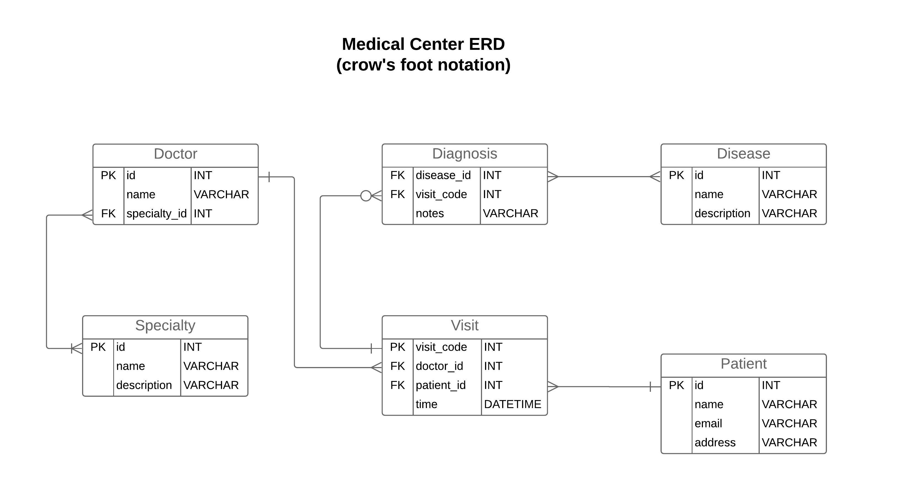
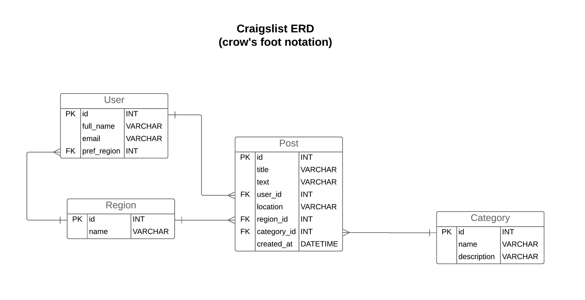
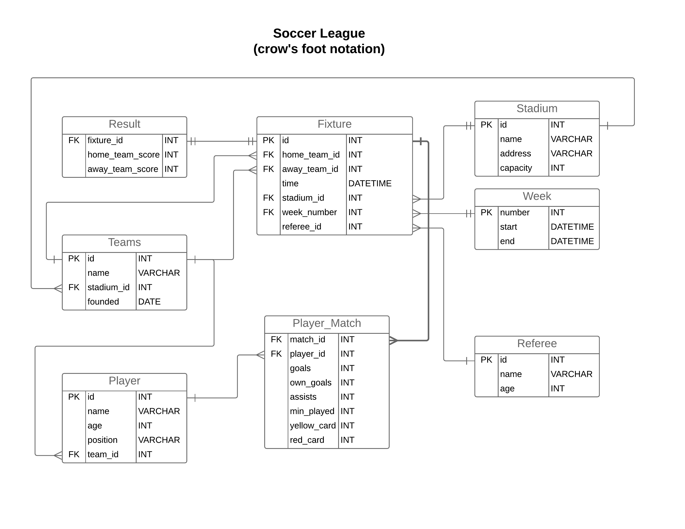

# Data Modeling: Schema Design and Generating DDL Commands

## Introduction

> In this exercise, I have done some data modeling and schema design. For each of these exercises, you can find erd diagrams and SQL DDL file links below.

## Part One: Medical Center

Design the schema for a medical center.

* A medical center employs several doctors
* A doctors can see many patients
* A patient can be seen by many doctors
* During a visit, a patient may be diagnosed to have one or more diseases.

**[>>DDL sql file for Medical Center<<](ddl_sql/Medical_Center_DDL.sql)**  
  **ERD for Medical Center is below:**   

## Part Two: Craigslist

Design the schema for Craigslist.

* The region of the craigslist post (San Francisco, Atlanta, Seattle, etc)
* Users and preferred region
* Posts: contains title, text, the user who has posted, the location of the posting, the region of the posting
* Categories that each post belongs to

**[>>DDL sql file for Medical Center<<](ddl_sql/Craigslist_DDL.sql)**   
  **ERD for Craigslist is below:**   

## Part Three: Soccer League

Design a schema for a simple sports league. 

* All of the teams in the league
* All of the goals scored by every player for each game
* All of the players in the league and their corresponding teams
* All of the referees who have been part of each game
* All of the matches played between teams
* All of the start and end dates for season that a league has
* The standings/rankings of each team in the league (This doesn’t have to be its own table if the data can be captured somehow).

**[>>DDL sql file for Soccer League<<](ddl_sql/Soccer_League_DDL.sql)**   
  **ERD for Soccer League is below:**

