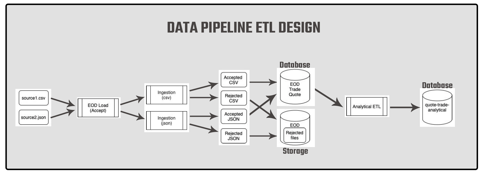
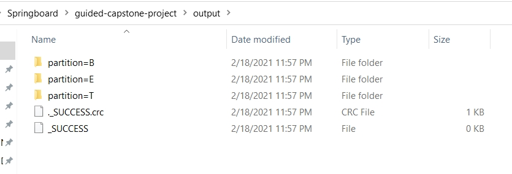

# EQUITY MARKET DATA ANALYSIS

## STEP 1: ETL DESIGN

## STEP 2: DATA INGESTION

#### OUTPUT SCHEMA
I have defined the 'partition' field as non-nullable whereas others as nullable in the main script([ingestion.py](src/ingestion.py)). This is due to the fact that for 'bad' records we report all fields as null except 'partition' and 'bad_line' fields.

		# Create a common output schema to apply when writing out the dataframes
		output_schema = StructType([StructField('trade_dt', DateType(), False),
						StructField('rec_type', StringType(), False),
						StructField('symbol', StringType(), False),
						StructField('exchange', StringType(), False),
						StructField('execution_id', StringType(), True),
						StructField('event_tm', TimestampType(), False),
						StructField('event_seq_nb', IntegerType(), False),
						StructField('arrival_tm', TimestampType(), False),
						StructField('trade_pr', DecimalType(7, 3), True),
						StructField('trade_size', IntegerType(), True),
						StructField('bid_pr', DecimalType(7, 3), True),
						StructField('bid_size', IntegerType(), True),
						StructField('ask_pr', DecimalType(7, 3), True),
						StructField('ask_size', IntegerType(), True),
						StructField('partition', StringType(), False),
						StructField('bad_line', StringType(), True)])
	
#### PARSING CSV FILE
I have created a function to parse the csv file line by line and enforce the expected data types and check the event_type values. If a line(row) doesn't fit to the expected profile it is marked as bad record("B") in the partition field. You can look into the [csv_parser.py](src/csv_parser.py) here in detail.

#### PARSING JSON FILE
I have created another function to parse the json file line by line and enforce the expected data types and check the event_type values. If a line(row) doesn't fit to the expected profile it is marked as bad record("B") in the partition field. Here I have assumed that each json record has all field names as in the common schema but may not have values depending on the type of the event. You can look into the [json_parser.py](src/json_parser.py) here in detail.

#### DATA INGESTION FRAMEWORK
We read the both csv and json input files as text files. We call the parsing functions inside the map function before converting them into dataframes.

Ingest csv data:

		# Import csv file, parse it and write out with the partition on append mode.
		raw = spark.sparkContext.textFile("../data/data.csv")
		parsed_csv = raw.map(lambda line: csv_parser.parse_csv(line))
		csv_df = spark.createDataFrame(parsed_csv, schema=output_schema)
		csv_df.write.partitionBy("partition").mode("append").csv("../output/")

Ingest json data:

		# Import json file, parse it and write out with the partition on append mode.
		raw = spark.sparkContext.textFile("../data/data.json")
		parsed_json = raw.map(lambda line: json_parser.parse_json(line))
		json_df = spark.createDataFrame(parsed_json, schema=output_schema)
		json_df.write.partitionBy("partition").mode("append").csv("../output/")

As you can see above, we write out the dataframes by enabling partition based on 'partition' column.

**Partition field** possible values:
1) **Q**: Quote Record
2) **T**: Trade Record
3) **B**: Bad Record Regardless of the Event Type

Output directory looks like:

<kbd>  </kbd>

## STEP 3: END-OF-DAY (EOD) DATA LOAD
Now that we’ve preprocessed the incoming data from the exchange, we need to create the final data format to store.

#### 3.1) Read Trade and Quote Partition Dataset From Their Temporary Location ####

	trade_common = spark.read.parquet("../output/partition=T")
		
	quote_common = spark.read.parquet("../output/partition=Q")
		
#### 3.2) Select The Necessary Columns For Trade and Quote Dataframes ###

	trade_df = trade_common.select("trade_dt", "symbol", "exchange", "execution_id", "event_tm", "event_seq_nb",
                               "arrival_tm", "trade_pr", "trade_size")
		
	quote_df = quote_common.select("trade_dt", "symbol", "exchange", "event_tm", "event_seq_nb",
                               "arrival_tm", "bid_pr", "bid_size", "ask_pr", "ask_size")
							   
#### 3.3) Create Window Specs and Apply Them to Retrieve the Records With The Latest Arrival Time ####

	trade_window = Window.partitionBy(col("trade_dt"), col("symbol"), col("exchange"), col("event_tm"), col("event_seq_nb"),
                                col("execution_id")).orderBy(col("arrival_tm").desc())
		
	trade_df = trade_df.withColumn("row_number", row_number().over(trade_window))
		
	trade_df = trade_df.where(col("row_number") == 1).drop(col("row_number")) # Drop row_number column 
								
	quote_window = Window.partitionBy(col("trade_dt"), col("symbol"), col("exchange"), col("event_tm"), col("event_seq_nb"))\
                   .orderBy(col("arrival_tm").desc())
				   
	quote_df = quote_df.withColumn("row_number", row_number().over(quote_window))
		
	quote_df = quote_df.where(col("row_number") == 1).drop(col("row_number")) # Drop row_number column 
		
#### 3.4) Write Out The Dataframes ####

	# Define a EOD date to use when writing Trade and Quote dataframes
	eod_date = d.today().date()
		
	# Write the cleaned Quote dataframe as parquet file
	trade_df.write.parquet("../output/trade/trade_dt={}" .format(eod_date))
	
	# Write the cleaned Quote dataframe as parquet file
	quote_df.write.parquet("../output/quote/quote_dt={}".format(eod_date))
		
## STEP 4: ANALYTICAL ETL ##
Now that we have loaded the trade and quote tables with daily records, this step focuses on using SparkSQL and Python to build an ETL job that calculates the following results for a given day:
- Latest trade price before the quote.
- Latest 30-minute moving average trade price, before the quote.
- The bid/ask price movement from previous day’s closing price.

#### 4.1) Read End-of-Day Trade Data and Calculate Moving Averages for Trade Price ####

	# Read end-of-day trade data
	df = spark.read.parquet(f"../output/trade/trade_dt={current_date}")

	# Create a view of end-of-day trade dataframe
	df.createOrReplaceTempView("current_trade_data")

	# Calculate moving average trade price for last 30 minutes for each trade record
	current_mov_avg_df = spark.sql("""SELECT symbol,exchange, event_tm, event_seq_nb, trade_pr,
									AVG(trade_pr) OVER(PARTITION BY symbol ORDER BY event_tm
									 BETWEEN 29 PRECEDING AND CURRENT ROW) AS mov_avg_pr 
									FROM current_trade_data""")

	# Create a view from moving averages dataframe
	current_mov_avg_df.write.saveAsTable("current_trade_moving_avg")
		
#### 4.2) Read Previous Date's End-of-Day Trade Data and Calculate Last Moving Average ####

	# Read previous date's trade data and create a view from it
	prev_df = spark.read.parquet(f"../output/trade/trade_dt={previous_date}")
	prev_df.createOrReplaceTempView("previous_last_trade")

	# Select last moving average trade price from previous date's moving averages table
	previous_last_pr = spark.sql("""SELECT symbol, exchange, mov_avg_pr AS last_pr
									FROM
									 (SELECT symbol, exchange, event_tm,	event_seq_nb, trade_pr,
										AVG(trade_pr) OVER(PARTITION BY symbol ORDER BY event_tm
											ROWS BETWEEN 29 PRECEDING AND CURRENT ROW) AS mov_avg_pr, 
											RANK() OVER(PARTITION BY symbol ORDER BY event_tm DESC) AS rnk
									 FROM previous_last_trade) prev
									WHERE prev.rnk = 1""")

	# Create a view from previous date's last moving average trade price table
	previous_last_pr.write.saveAsTable("previous_last_trade_pr")
		
#### 4.3) Read Current Date's Quote Data and Make Final Transformations ####

	# Read current date's quote data and save it as a view
	quote_df = spark.read.parquet(f"../output/quote/quote_dt={current_date}")
	quote_df.write.saveAsTable("quote_table")

	# Union quote data with current_date's table of moving averages trade price on a common schema
	quote_union_df = spark.sql("""SELECT null AS trade_dt, "T" AS rec_type, symbol, exchange, event_tm, event_seq_nb,
									null AS bid_pr, null AS bid_size, null AS ask_pr, null AS ask_size,trade_pr, mov_avg_pr
								FROM current_trade_moving_avg
								UNION ALL
								SELECT trade_dt, "Q" AS rec_type, symbol, exchange, event_tm, event_seq_nb, bid_pr,
									bid_size,ask_pr, ask_size, null AS trade_pr, null AS mov_avg_pr
								FROM quote_table""")

	# Save union dataframe as a view
	quote_union_df.createOrReplaceTempView("quote_union")

	# Populate the most recent trade price and moving average trade price into quote records for current date
	quote_union_update = spark.sql("""SELECT trade_dt, rec_type, symbol, exchange, event_tm, event_seq_nb,
										bid_pr, bid_size,ask_pr, ask_size,
										MAX(last_trade_pr) OVER(PARTITION BY symbol) AS last_trade_pr,
										MAX(last_mov_pr) OVER(PARTITION BY symbol) AS last_mov_avg_pr
									 FROM
										(SELECT
											*,
											CASE WHEN rnk = 1 THEN trade_pr ELSE 0 END AS last_trade_pr,
											CASE WHEN rnk = 1 THEN mov_avg_pr ELSE 0 END AS last_mov_pr
										FROM
										 (SELECT
											*,
											CASE WHEN trade_pr IS NULL THEN NULL
											ELSE RANK() OVER (PARTITION BY symbol ORDER BY
														CASE WHEN trade_pr IS NULL THEN 1
													 ELSE 0 END, event_tm DESC)
											END AS rnk
										FROM quote_union))""")

		# Create a view for updated union
		quote_union_update.createOrReplaceTempView("quote_union_update")

		# Select required fields and filter by quote records.
		quote_update = spark.sql("""SELECT trade_dt, symbol, event_tm, event_seq_nb, exchange, bid_pr,
									bid_size, ask_pr, ask_size, last_trade_pr, last_mov_avg_pr
									FROM quote_union_update
									WHERE rec_type = 'Q'""")

		# Create a view from filtered quote dataframe
		quote_update.createOrReplaceTempView("quote_update")

		# Calculate bid price movement and ask price movement
		quote_final = spark.sql("""
								SELECT
									trade_dt, symbol, event_tm, event_seq_nb, exchange, bid_pr,
									bid_size, ask_pr, ask_size, last_trade_pr,last_mov_avg_pr,
									bid_pr - last_pr as bid_pr_mv,
									ask_pr - last_pr as ask_pr_mv
								FROM (
									 SELECT /*+ BROADCAST(p) */
										q.*,
										p.last_pr
									FROM quote_update q LEFT OUTER JOIN previous_last_trade_pr p
										ON q.symbol = p.symbol AND q.exchange = p.exchange
									) a
								""")

		# Write finalized dataframe as parquet file
		quote_final.write.parquet(f"../output/quote-trade-analytical/date={current_date}")

## STEP 5: PIPELINE ORCHESTRATION ##

#### 4.3) Workflows ####
I have chained the workflows in a [bash script](/src/spark-submit.sh). It means to jump to next job, previous job needs to be completed. Here we capture current date as a system argument in the bash command. Normally we don't need to hardcode the date, but since I have limited data here I pass '2020-01-02' for all workflows.

	#!/bin/bash
	spark-submit \
	--master local \
	--py-files /Users/muhid/Desktop/Springboard/guided-capstone-project/src/etl.zip \
	ingestion.py 2020-01-02
	&&
	spark-submit \
	--master local \
	--py-files /Users/muhid/Desktop/Springboard/guided-capstone-project/src/etl.zip \
	eod_load.py 2020-01-02 \
	&&
	spark-submit \
	 --master local \
	 --py-files /Users/muhid/Desktop/Springboard/guided-capstone-project/src/etl.zip \
	analytical_etl.py 2020-01-02

#### 4.3) Job Tracking ####
I have created a [tracker class](/src/job_tracking.py) with needed methods to update job status. This class uses MySQL to store and update job status. Possible job names are: 'initial_ingestion', 'eod_load' and 'analytical_etl'.
 
Job status table contains these fields:
- job_id(primary key): naming convention is jobname_yyyy-mm-dd
- job_status: success or failure state of the job
- Updated_time: datetime of the entry

We utilize this class to:
- Assign job id
- Update job status
- Get job status

I have placed all transformation codes in the etl pipeline into a try-except block for each python file. By doing that, we catch errors when executing the scripts and update this job as 'failed'. If everything works fine, we update the job as a 'success'. Below is an example of try-catch block for job tracking.

	# Get date argument from bash command
	current_date = str(sys.argv[1])

	# Create a job tracker instance
	tracker = job_tracking.Tracker("analytical_etl", current_date)

	# Applying try-except block for the whole script to track job status in MySQL
	**try:**
		.
		.
		.
		TRANSFORMATIONS
		.
		.
		.
		# Update job status accordingly in MySQL if there is no exception
		tracker.update_job_status("success")
	**except Exception as e:**
		print(e)
		# Update job status accordingly in MySQL if there is exception
		tracker.update_job_status("failed")
		
After running all workflows sequentially, below is an example showing what we see for that day's jobs status in MySQL:

<kbd></kbd>

	