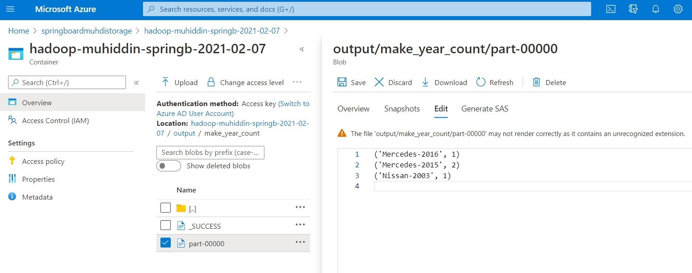

# HADOOP MINI PROJECT: MAPREDUCE JOBS

## Introduction

>  In this project, we are given a dataset with a history report of various vehicles. Our goal is to write a MapReduce program to produce a report of the total number of accidents per make and year of the car. The MapReduce scripts resides in the [src](src) folder. [Input data](data/data.csv) is in [data](data) folder.

## HOW PROGRAM WORKS

### Input File Sample Records:
Original csv file doesn't have headers.

| id  | incident_type | vin | make   | model | year | incident_date | description					 |
|----|---|-------------------|----------|--------|------|------------|-------------------------------|
| 1  | I | VXIO456XLBB630221 | Nissan   | Altima | 2003 | 2002-05-08 | Initial sales from TechMotors |
| 2  | I | INU45KIOOPA343980 | Mercedes | C300   | 2015 | 2014-01-01 | Sold from EuroMotors          |
| 3  | A | VXIO456XLBB630221 |          |        |      | 2014-07-02 | Head on collision             |
| 4  | R | VXIO456XLBB630221 |          |        |      | 2014-08-05 | Repair transmission           |
| 5  | I | VOME254OOXW344325 | Mercedes | E350   | 2015 | 2014-02-01 | Sold from Carmax              |
| 6  | R | VOME254OOXW344325 |          |        |      | 2015-02-06 | Wheel allignment service      |
| 7  | R | VXIO456XLBB630221 |          |        |      | 2015-01-01 | Replace right head light      |
| 8  | I | EXOA00341AB123456 | Mercedes | SL550  | 2016 | 2015-01-01 | Sold from AceCars             |
| 9  | A | VOME254OOXW344325 |          |        |      | 2015-10-01 | Side collision                |
| 10 | R | VOME254OOXW344325 |          |        |      | 2015-09-01 | Changed tires                 |
| 11 | R | EXOA00341AB123456 |          |        |      | 2015-05-01 | Repair engine                 |
| 12 | A | EXOA00341AB123456 |          |        |      | 2015-05-03 | Vehicle rollover              |
| 13 | R | VOME254OOXW344325 |          |        |      | 2015-09-01 | Replace passenger side door   |
| 14 | I | UXIA769ABCC447906 | Toyota   | Camery | 2017 | 2016-05-08 | Initial sales from Carmax     |
| 15 | R | UXIA769ABCC447906 |          |        |      | 2020-01-02 | Initial sales from Carmax     |
| 16 | A | INU45KIOOPA343980 |          |        |      | 2020-05-01 | Side collision                |

### Steps:

**Note:** Python scripts are written for Python 2.7 since Azure HDInsight Hadoop cluster had Python 2.7 version. Be sure to have appropriate Python version in the hadoop environment. 

**1) [autoinc_mapper1.py](src/autoinc_mapper1.py)**: Reads lines from the stdin and writes lines to stdout after selecting vin as key and (incident type, make, year) as the value.

Output looks like (not sorted version here):

| vin 	| incident_type | make   | year |
|-------------------|---|----------|------|
| VXIO456XLBB630221 | I | Nissan   | 2003 |
| INU45KIOOPA343980 | I | Mercedes | 2015 |
| VXIO456XLBB630221 | A |          |      |
| VXIO456XLBB630221 | R |          |      |
| VOME254OOXW344325 | I | Mercedes | 2015 |
| VOME254OOXW344325 | R |          |      |
| VXIO456XLBB630221 | R |          |      |
| EXOA00341AB123456 | I | Mercedes | 2016 |
| VOME254OOXW344325 | A |          |      |
| VOME254OOXW344325 | R |          |      |
| EXOA00341AB123456 | R |          |      |
| EXOA00341AB123456 | A |          |      |
| VOME254OOXW344325 | R |          |      |
| UXIA769ABCC447906 | I | Toyota   | 2017 |
| UXIA769ABCC447906 | R |          |      |
| INU45KIOOPA343980 | A |          |      |

**2) [autoinc_reducer1.py](src/autoinc_reducer1.py)**: Reads lines written by the first mapper, fills the null cells for make and model and returns one line (vin, make, year) per accident per vin number.

Output looks like (not sorted version here):

| vin               | make     | year |
|-------------------|----------|------|
| VXIO456XLBB630221 | Nissan   | 2003 |
| VOME254OOXW344325 | Mercedes | 2015 |
| EXOA00341AB123456 | Mercedes | 2016 |
| INU45KIOOPA343980 | Mercedes | 2015 |

**3) [autoinc_mapper2.py](src/autoinc_mapper2.py)**: Reads lines written by the first reducer. Concatenates make and model, and returns make-model composite as key and count = 1 as the value.

Output looks like (not sorted version here):

| make-year     | count |
|---------------|-------|
| Nissan-2003   | 1     |
| Mercedes-2015 | 1     |
| Mercedes-2016 | 1     |
| Mercedes-2015 | 1     |

**4) [autoinc_reducer2.py](src/autoinc_reducer2.py)**: Reads lines written by the second mapper. Groups the records by key (make-model) and returns with the aggregate count.

Output looks like:

| make-year     | count |
|---------------|-------|
| Nissan-2003   | 1     |
| Mercedes-2015 | 2     |
| Mercedes-2016 | 1     |

## TESTING
After navigating to the inside the main folder, you can run the command chain below to test the scripts.

		cat data/data.csv | python src/autoinc_mapper1.py | sort | python src/autoinc_reducer1.py | python src/autoinc_mapper2.py | sort | python src/autoinc_reducer2.py

## RUNNING ON HADOOP

In a hadoop cluster, you need to copy [input data](data/data.csv) into hadoop cluster and yield the hdfs path of the input file into the hadoop jar command as '-input' argument. You can edit [run-on-hadoop.sh](run-on-hadoop.sh) to update input_file path and then you can run it. Also make sure required read and write permissions are available for the scripts, input and output directories and files. Since backslashes caused errors I couldn't split the lines. Also be aware of that we connect two hadoop jar commands with '&&', which implies second job will be run if the first job completes successfully.

After jobs are successfully run you can check final output path to view output files:

## LOGGING

For logging, the program utilizes the **[yaml log config file](docs/check.logging.yml)** which resides in **[docs](docs)** folder. Logger writes messages only to **[check.log](logs/check.log)** file in the **[logs](logs)** folder. Successful run of every script is logged.

