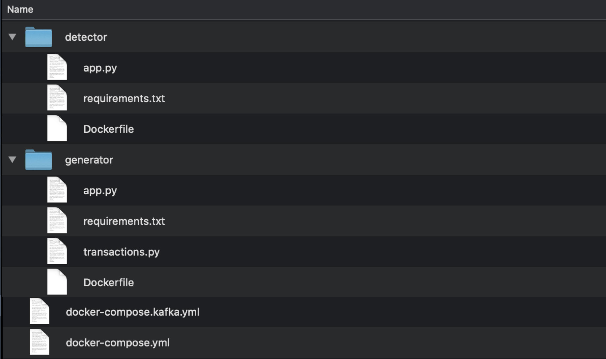
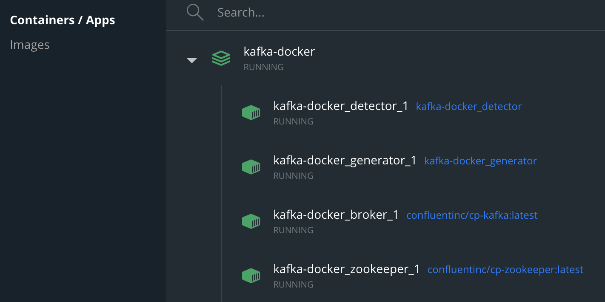
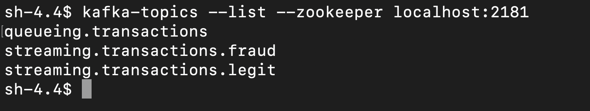
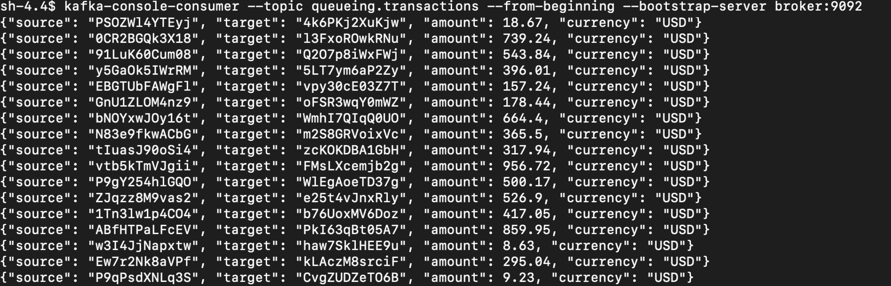

# KAFKA PROJECT

### **Building A Streaming Fraud Detection System With Kafka + Python**


## Introduction

>  In this tutorial, we will create a streaming application backed by **Apache Kafka** using a **Python** client. We will try and make it as close as possible to a **real-world** Kafka application.
>
>  What we'll build is a **real-time fraud detection system**. We will generate a stream of transactions and then we will write a Python script to process those stream of transactions to detect which ones are potential fraud.

## PART A: Creating Project Structure

### 1) Creating Dockerfiles

We will use the same docker file for the both generator and detector scripts. In respective directories, we will name both scripts as **"app.py".** To note, we will include the same [requirements.txt](./generator/requirements.txt) file in both script directories which only lists **"kafka-python"** as dependency.

```dockerfile
# Dockerfile
FROM python:3.6

WORKDIR /usr/app

COPY . .
RUN pip install -r requirements.txt


ENTRYPOINT ["python"]
CMD ["app.py"]
```

### 2) Creating YAML files for Docker Compose

We will use two separate yaml files for resiliency. One for only broker and zookeeper and another one for detector and generator apps.

Before creating yml files, let's first create a network to create a connection among containers:

```bash
 $ docker network create kafka-network
```


##### 	a) docker-compose.kafka.yml for Kafka broker and zookeper

```yaml
version: "3"

services:
  zookeeper:
    image: confluentinc/cp-zookeeper:latest
    environment:
      ZOOKEEPER_CLIENT_PORT: 2181
      ZOOKEEPER_TICK_TIME: 2000
  broker:
    image: confluentinc/cp-kafka:latest
    depends_on:
      - zookeeper
    environment:
      KAFKA_BROKER_ID: 1
      KAFKA_ZOOKEEPER_CONNECT: zookeeper:2181
      KAFKA_ADVERTISED_LISTENERS: PLAINTEXT://broker:9092
      KAFKA_OFFSETS_TOPIC_REPLICATION_FACTOR: 1
networks: 
  default:
    external:
      name: kafka-network
```

##### 	b) docker-compose.yml for generator and detector apps:

```yaml
version: '3'
services:
  generator:
    build:
      context: ./generator
    environment:
      KAFKA_BROKER_URL: 'broker:9092'
      TRANSACTIONS_TOPIC: queueing.transactions
      TRANSACTIONS_PER_SECOND: 1
  detector:
    build:
      context: ./detector
    environment:
      KAFKA_BROKER_URL: 'broker:9092'
      TRANSACTIONS_TOPIC: queueing.transactions
      LEGIT_TOPIC: streaming.transactions.legit
      FRAUD_TOPIC: streaming.transactions.fraud
networks:
  default:
    external:
      name: kafka-network
```

### 3) Creating generator app

We will use a random transaction generator (create_random_transaction method) inside the **[generator app]()**. Let's first create **[transactions.py](./generator/transactions.py)** for that.

```python
# generator/transactions.py
from random import choices, randint
from string import ascii_letters, digits

account_chars: str = digits + ascii_letters

def _random_account_id() -> str:
    """Return a random account number made of 12 characters."""
    return "".join(choices(account_chars, k=12))

def _random_amount() -> float:
    """Return a random amount between 1.00 and 1000.00."""
    return randint(100, 100000) / 100

def create_random_transaction() -> dict:
    """Create a fake, randomised transaction."""
    return {
        "source": _random_account_id(),
        "target": _random_account_id(),
        "amount": _random_amount(),
        # Keep it simple: it's all dollars
        "currency": "USD"
    }
```

Then create the actual generator app:

```python
from kafka import KafkaProducer
from time import sleep
from transactions import create_random_transaction
import os
import json

KAFKA_BROKER_URL = os.environ.get("KAFKA_BROKER_URL")
TRANSACTIONS_TOPIC = os.environ.get("TRANSACTIONS_TOPIC")
TRANSACTIONS_PER_SECOND = float(os.environ.get("TRANSACTIONS_PER_SECOND"))
SLEEP_TIME = 1 / TRANSACTIONS_PER_SECOND
if __name__ == '__main__':
    producer = KafkaProducer(
        bootstrap_servers=KAFKA_BROKER_URL,
        # Encode all values as JSON
        value_serializer=lambda value: json.dumps(value).encode()
    )
    while True:
        transaction = create_random_transaction()  # Dictionary
        message = json.dumps(transaction)          # String
        producer.send(TRANSACTIONS_TOPIC, value=transaction)
        print(transaction)  # DEBUG
        sleep(SLEEP_TIME)

```

### 4) Creating detector app
```python
# detector/app.py
import os
import json
from kafka import KafkaConsumer, KafkaProducer

KAFKA_BROKER_URL = os.environ.get("KAFKA_BROKER_URL")
TRANSACTIONS_TOPIC = os.environ.get("TRANSACTIONS_TOPIC")
LEGIT_TOPIC = os.environ.get("LEGIT_TOPIC")
FRAUD_TOPIC = os.environ.get("FRAUD_TOPIC")

def is_suspicious(transaction: dict) -> bool:
    """Determine whether a transaction is suspicious."""
    return transaction["amount"] >= 900

if __name__ == "__main__":
    consumer = KafkaConsumer(
        TRANSACTIONS_TOPIC,
        bootstrap_servers=KAFKA_BROKER_URL,
        value_deserializer=lambda value: json.loads(value)
    )
    producer = KafkaProducer(
        bootstrap_servers=KAFKA_BROKER_URL,
        value_serializer=lambda value: json.dumps(value).encode()
    )
    for message in consumer:
        transaction: dict = message.value
        topic = FRAUD_TOPIC if is_suspicious(transaction) else LEGIT_TOPIC
        producer.send(topic, value=transaction)
        print(topic, transaction)  # DEBUG
```
### PART B: EXECUTION ###

Let's see the current project structure at this point:



### 1) Create Images and Containers

Spinning Kafka broker and zookeeper first:

```bash
docker-compose -f docker-compose.kafka.yml up
```

Then for apps:

```
docker-compose up
```

### 2) Verify the results

* Looking into docker containers:



* Listing topics:



- Consume source streams from the console:

- 

- Consume legit streams from the console:

- 

- Consume fraud streams from the console:

  

