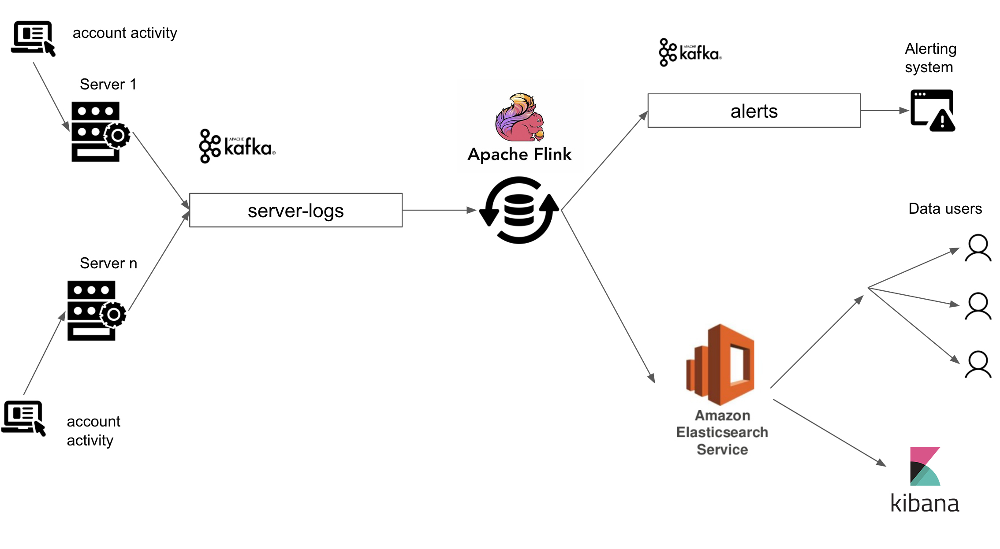
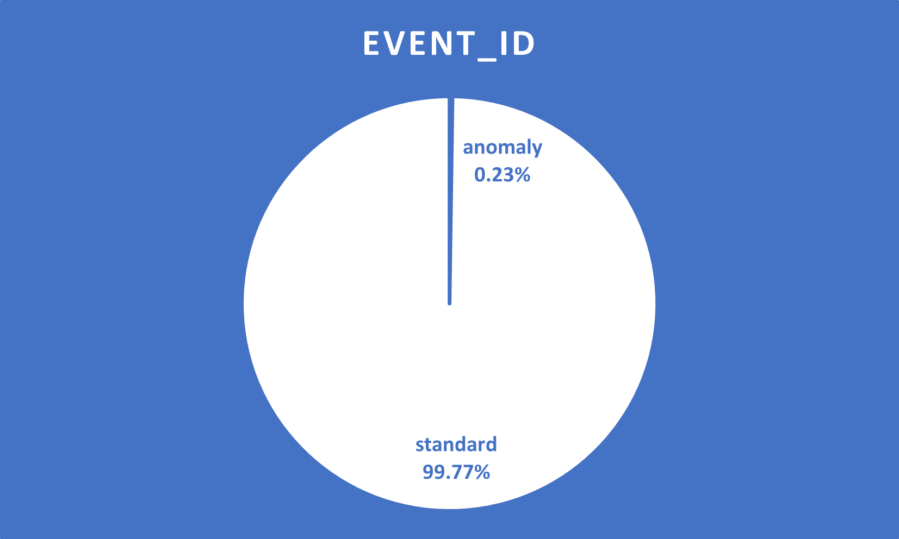
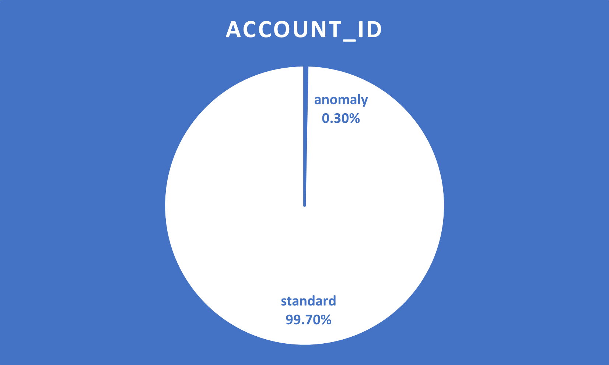
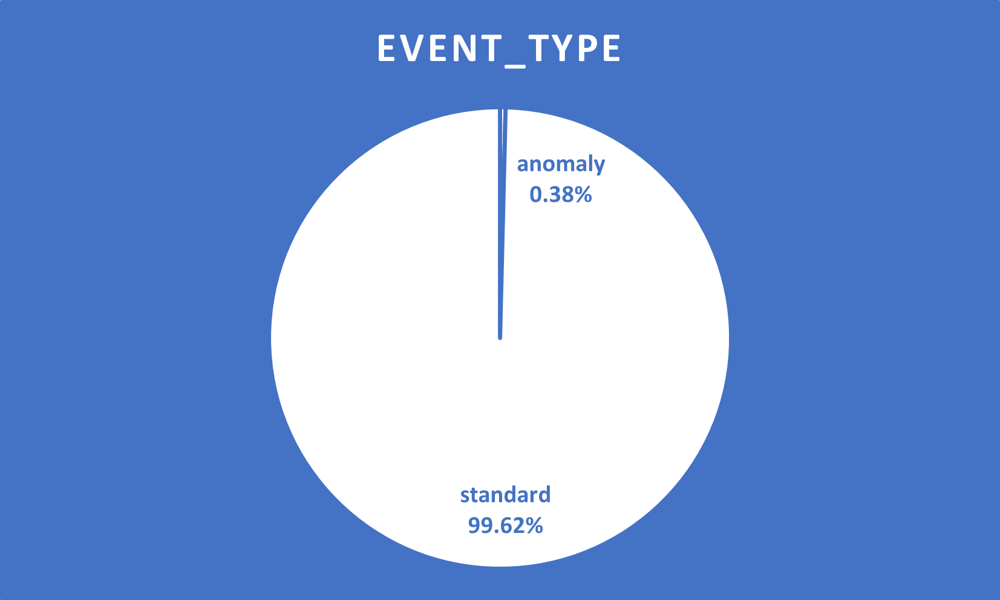
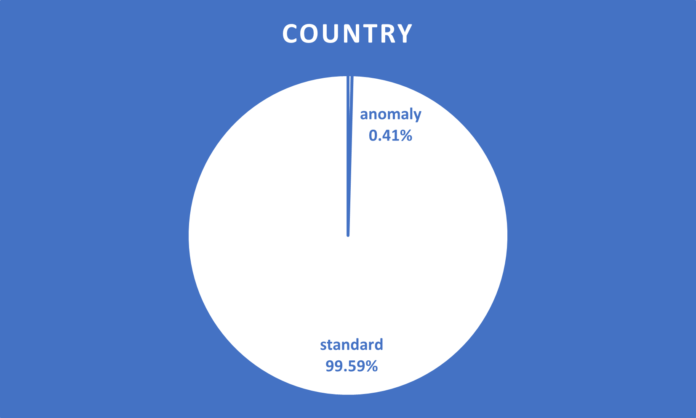
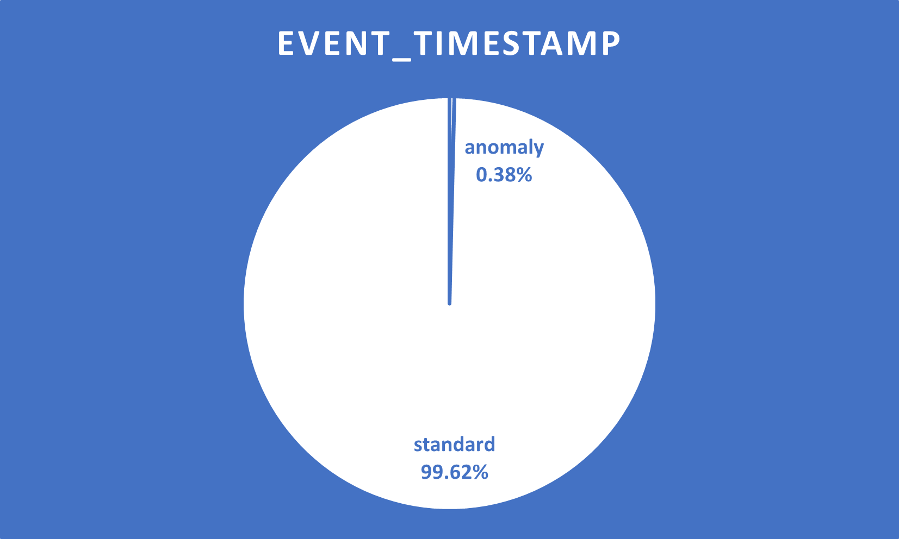

# Open Ended Data Engineering Capstone Project

## Design

## Data

The data will be generated by a data generation script at `src/main/python/com.openendedstreamproject/ServerLogGenerator.py`.
Currently when we run [ServerLogGenerator.py](src\main\python\com.openendedstreamproject\ServerLogGenerator.py), it creates a dataset with 200K rows and stores it to a local directory.

## Data Anomalies

### 1) event_id
Normally we defined event_id as an UUID in the ServerLogGenerator class, but we injected some anomaly values as in the list [0, None, 'N/A'].

### 2) account_id
account_id is supposed to in the range (1,1000) as defined in the get_server_log method of the ServerLogGenerator class, but we added some anomaly values as in the list ['N/A',None,0]. Also the random integers may become floats for account_id, we also should take care of this.

### 3) current_event_type
current_event_type is supposed to be one of the values in the event type list defined in the ServerLogGenerator class, but we injected some anomaly values as in the list ['N/A',None,'---', 0].

### 4) current_country
current_country is supposed to be one of the values in the country list defined in the ServerLogGenerator class, but we injected some anomaly values as in the list ['N/A',None,'unknown', 0].

### 5) event_timestamp
event_timestamp is supposed to be one of the values in the country list defined in the ServerLogGenerator class, but we injected some anomaly values as in the list ['N/A',None,0]. Also, some records has decimal part and also some timestamps are just in date format. (YYYY/MM/DD)

