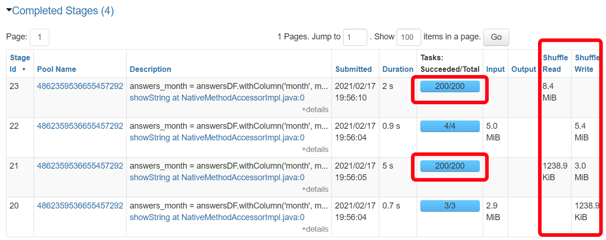
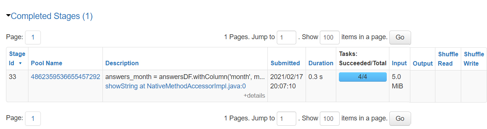
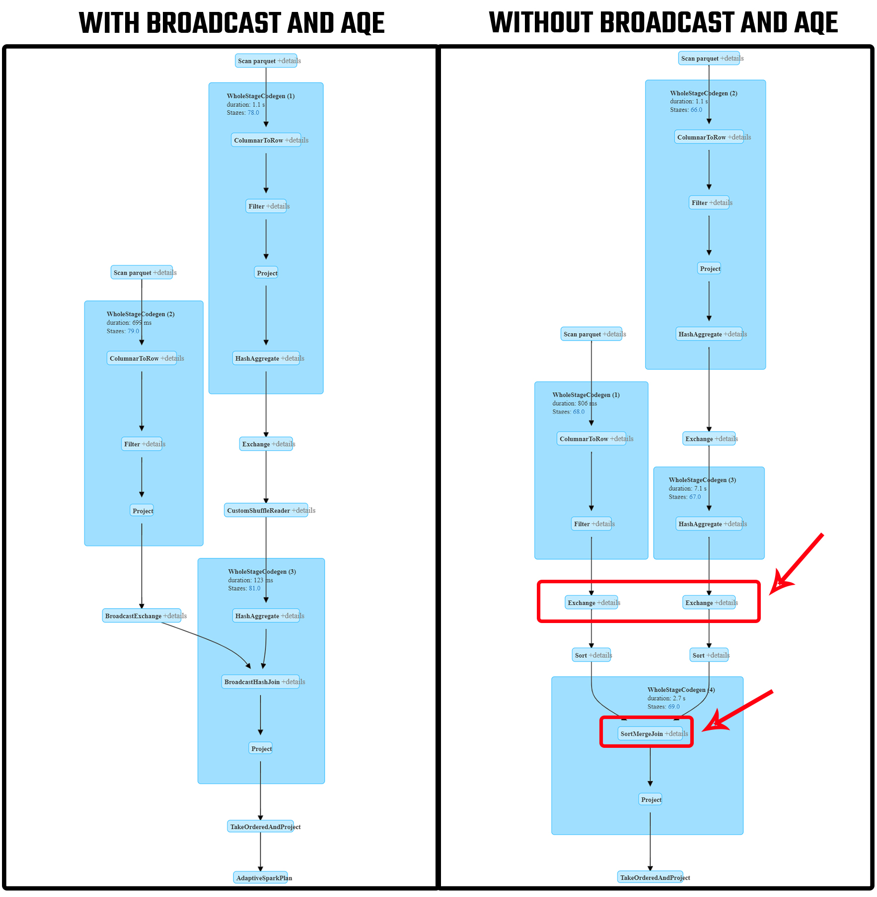

# SPARK OPTIMIZATION PROJECT

## Introduction

>  In this project, we will try to evaluate the Spark code and try to optimize it. [Spark script](optimize.py) resides in the main folder. [Input data] is in [data](data) folder.

## EVALUATING PERFORMANCE

### Without Broadcast and Adaptive Query
When I run the script on Databricks, I have seen that there was no room for optimization since the data is smaller than 10 MB, broadcast is automatically deployed. In addition, suprisingly adaptive query execution was also enabled although the adaptive query execution is disabled by default as far as I know. Anyway let's disable both adaptive query execution and broadcast to simulate having a large dataset without adaptive query execution and run the script.

		spark.conf.set("spark.sql.adaptive.enabled", "false")
		spark.conf.set("spark.sql.autoBroadcastJoinThreshold", "-1")

Let's look into the stages and tasks:

<kbd>  </kbd>

### With Broadcast and Adaptive Query

Let's enable the related settings again:

		spark.conf.set("spark.sql.adaptive.enabled", "true")
		spark.conf.set("spark.sql.autoBroadcastJoinThreshold", "10485760")
		
When I run the script, I have also explicitly called broadcast on answersDF.

		resultDF = questionsDF.join(broadcast(answers_month), 'question_id')\
							  .select('question_id', 'creation_date', 'title', 'month','cnt')
							 
Let's look into the stages and tasks:

<kbd>  </kbd>

We can change the broadcast threshold if there will be no memory issues to gain better performance. (Default is 10 MB)

		# Setting broadcast threshold as 100MB
		spark.conf.set("spark.sql.autoBroadcastJoinThreshold", "104857600")

After running the script with and without broadcast and AQE(adaptive query execution) settings, let's compare the query execution plans:

<kbd>  </kbd>

### Repartition

I have also added repartition before the join on questions dimension table by the key column (question_id) which is used for join.

		questionsDF = questionsDF.repartition(4, 'question_id')
		
Repartition is useful when repartitioned dataframe is joined more than once. Since we join once in this script, it is not possible to see performance improvement.
		
