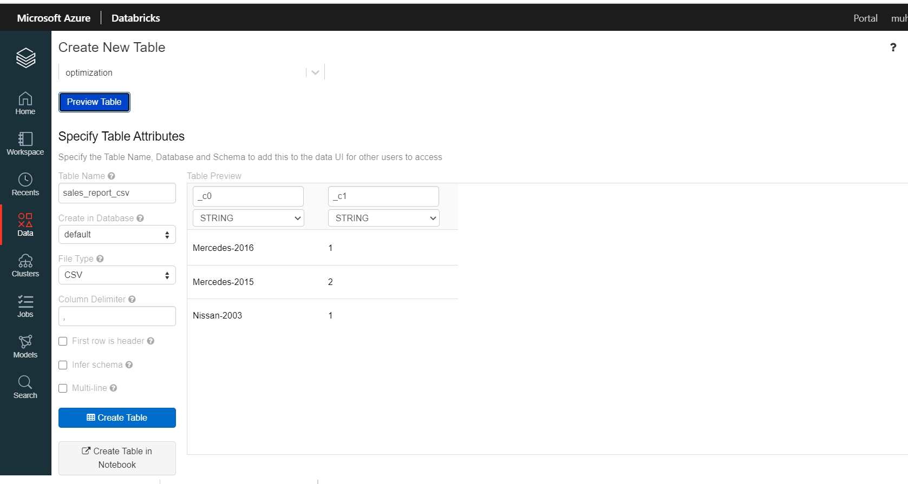

# SPARK MINI PROJECT: CAR SALES REPORT

## Introduction

>  For this project, we are leveraging Spark as the new engine to redesign the Hadoop auto post-sales report project that was previously done in MapReduce. Spark script resides in the [src](src) folder. [Input data](data/data.csv) is in [data](data) folder.

## HOW PROGRAM WORKS

### 1) Creating a schema for the csv input table:
Original csv file doesn't have headers.

		schema = StructType([
			StructField("incident_id",IntegerType(),True),
			StructField("incident_type",StringType(),True),
			StructField("vin",StringType(),True),
			StructField("make", StringType(), True),
			StructField("model", StringType(), True),
			StructField("year", IntegerType(), True),
			StructField("incident_date", StringType(), True),
			StructField("description", StringType(), True)])

### 2) Importing the csv file with the schema above

		sales = spark.read.format('csv') \
			.option("header", False) \
			.option("sep", ',') \
			.schema(schema) \
			.load("data/data.csv")

### 3) Filling out missing info
- Extract make and model info per vin group using Window
- Filter the rows with the incident_type 'A'
- Select only make and model columns

		windowSpec = Window.partitionBy("vin").orderBy("vin")
		sales = sales.withColumn("make2", max("make").over(windowSpec)) \
					 .withColumn("year2", max("year").over(windowSpec)) \
					 .filter(col("incident_type") == 'A') \
					 .select(col('make2').alias('make'), col('year2').alias('year'))

Output looks like:

| make     | year |
|----------|------|
| Nissan   | 2003 |
| Mercedes | 2015 |
| Mercedes | 2015 |
| Mercedes | 2016 |

### 4) Counting records per make-year pair:
- Mapping the lambda function to convert each row into tuple(make-year, 1)
- Apply reduceByKey to aggregate the count per make-year pair
- Convert the resulting rdd to dataframe
- Write the dataframe as a csv file

		report_df = sales.rdd.map(lambda x: tuple([x["make"] + '-' + str(x["year"]), 1]))\
                     .reduceByKey(lambda x, y: x+y)\
                     .toDF(('Make_Year', 'Count'))\
                     .write.csv("output/Sales_Report.csv")

Output looks like:

| Make_Year     | Count |
|---------------|-------|
| Nissan-2003   | 1     |
| Mercedes-2015 | 2     |
| Mercedes-2016 | 1     |

## RUNNING THE SPARK SCRIPT
After navigating to the inside the main folder, you can run the following command. Be sure to check %SPARK_HOME%/bin is in the defined paths.

		spark-submit src/Sales_Report.py >>./logs/execution_log.txt 2>&1

## OUTPUT FILE

You can check the command line execution logs in the [execution log file](logs/execution_log.txt). After the script are successfully run, you will find the [output](output) folder in the main project structure to view output csv files.

I have run the script on Databricks:

