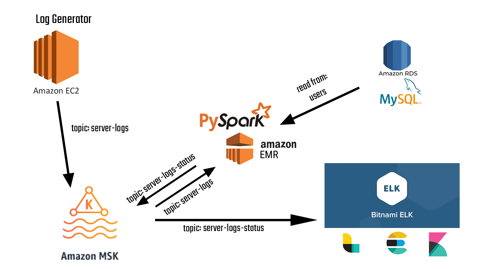
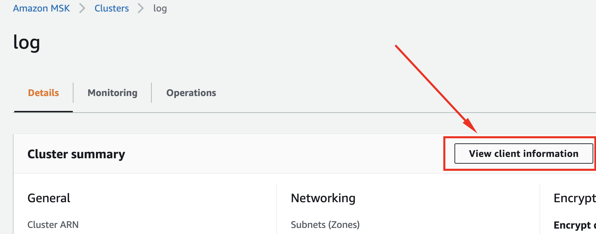
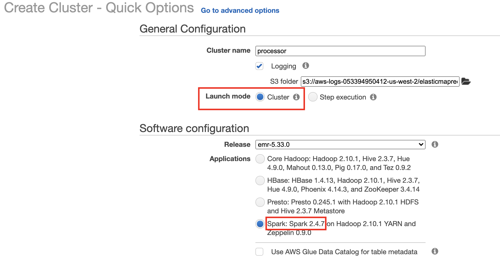
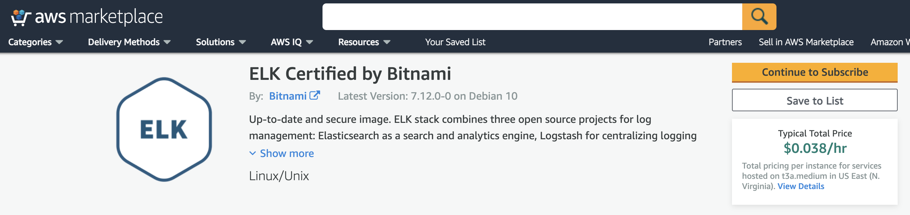
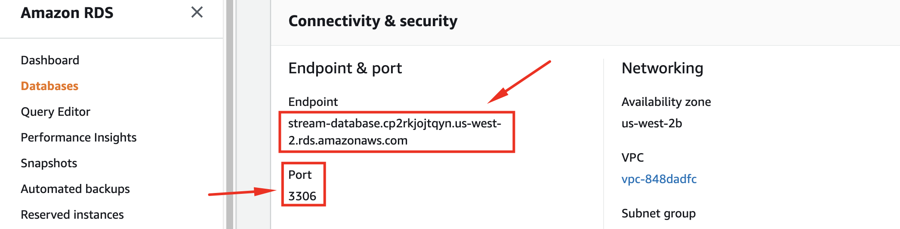
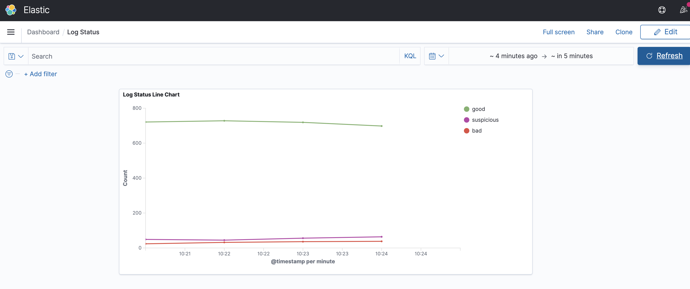
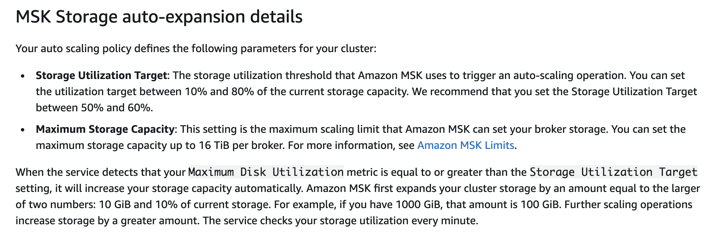

# STREAMING PROJECT: DEPLOY ON AWS

### **Building A Streaming Pipeline On AWS**


## Introduction

>  In this project, we will deploy our local streaming pipeline backed by an **EC2** instance, **AWS MSK**, **AWS EMR** and **Bitnami ELK Stack** on AWS.
>
>  What we'll build is a log generator and processor. We will generate a stream of logs on a EC2 instance and then we will use a PySpark script to process those stream of logs to categorize logs: goods, bad and suspicious using EMR. We will use data completeness together with consistency with a dimensional user table in AWS RDS (MySql) as our criteria. Let's look into our design:
>
>  

* Our log generator will send the logs to server-logs topic in AWS MSK.

* Spark Structued Streaming on EMR will read these messages in realtime and will split the micro batches into 3 categories:

  - **bad_logs**: If logs are not following our desired data type schema or if they embed a null value in any field. 
  - **suspicious_logs**: We compare log's device type against the user's default device type in our **users** table in MySQL dim_users database. If they don't match we label the log as suspicious. We do this by joining micro batch with **users** dimensional table on **account_id** and **device** fields.
  - **good_logs:** If a log is not bad or suspicious, we label it as 'good'.


# PART A: Infrastructure

### 1) EC2 Instance

I have configured a free tier EC2 instance with Amazon Linux. We will use key file that we have saved when we ssh into the instance and also for copying log generator related files to the instance.

- SSH into our log generator EC2 instance

  ```bash
  ssh -i log-generator.cer ec2-user@ec2-54-200-184-218.us-west-2.compute.amazonaws.com
  ```

- Check whether  Java 8 or above is installed

  ```bash
  java --version
  ```

- Ensuring python version compatibility by installing 3.8

  ```bash
  sudo amazon-linux-extras install python3.8
  ```

- Copying the generator zip file from local machine to the EC2 instance

  ```bash
  scp -i log-generator.cer generator.zip ec2-user@ec2-54-200-184-218.us-west-2.compute.amazonaws.com:~/.
  ```

- Unzip the zip file and then install required modules using [requirements.txt](./generator/requirements.txt)

  ```bash
  unzip generator.zip
  sudo python3.8 -m pip install -r requirements.txt	
  ```

- We will use this EC2 instance as a Kafka Client to interact with our Kafka cluster. Let's download Kafka on this instance.

```bash
# Download the Kafka
wget http://mirror.fibergrid.in/apache/kafka/0.10.2.0/kafka_2.12-0.10.2.0.tgz
# Unzip the downloaded tar file
tar -xzf kafka_2.12-0.10.2.0.tgz
```

### 2) Kafka Cluster

We will create a MSK cluster based on our needs. After creating the cluster we need to get the broker and zookeeper information as shown below:




We will use this information to pass into our generator script to be able to send the logs into the cluster as well as for other configurations related to our Kafka cluster.

### 3) EMR Cluster

We will create an EMR cluster with the same key file that we used before for convenience and we will submit our processor script using bash commands in the master node.



- Ensuring python version compatibility by installing 3.8

  ```bash
  sudo amazon-linux-extras install python3.8
  ```

- Copy the processor zip file to the master instance. Be aware that generally user is not ec2-user for master nodes.

  ```
  scp -i log-generator.cer processor.zip hadoop@ec2-34-221-85-20.us-west-2.compute.amazonaws.com:~/.
  ```

- Unzip the zip file and then install required modules using [requirements.txt](./generator/requirements.txt)

  ```bash
  unzip processor.zip
  sudo python3.8 -m pip install -r requirements.txt	
  ```

### 4) Bitnami ELK Stack

We can use Bitnami ELK Stack in the AWS Marketplace for log processing and visualization.



After subscribing for that service and creating the ELK instance, we need to ssh into the ELK instance and configure all the settings related to the pipeline design. 

* We essentially need to locate and edit **logstash_sample.conf** file in logstash config folder.  We can change the name of the conf file.

  ```yaml
  # logstash.conf
  # We read from a Kafka topic as input
  input {
      kafka {
      # We have 2 brokers in our cluster
              bootstrap_servers => "b-2.log.02msna.c8.kafka.us-west-2.amazonaws.com:9092,b-1.log.02msna.c8.kafka.us-west-2.amazonaws.com:9092"
              topics => ["server-logs-status"]
      }
  }
  
  # We parse the original json message into fields, then filter out the original message
  filter {
        json {
          source => "message"
        }
  
        mutate {
          remove_field => [ "message" ]
        }
  
      }
  
  # We send the data to the 'server-logs' index in elastichsearch from where Kibana will read
  output {
     elasticsearch {
        hosts => ["localhost:9200"]    # We need to ensure that hostname and port are correct
        index => "server-logs"
        workers => 1
      }
  }

### 5) AMAZON RDS for MySQL

We will create a Dev-Test MySQL database to avoid high costs and we will get the connection info so that we can use it in our spark_processor script and mysql connection script. When we run spark_processor script, it will call another script to create the database and user table automatically using this MySql connection information.




# PART B: Execution #

#### 1) Running The Log Generator

Let's run our generator script on the log generator EC2 instance. We pass broker connection strings and topic name as arguments.

```bash
python3.8 kafka_producer.py "b-2.log.02msna.c8.kafka.us-west-2.amazonaws.com:9092,b-1.log.02msna.c8.kafka.us-west-2.amazonaws.com:9092" "server-logs"
```


#### 2) Submitting The Processor Script

After we ssh into the EMR master node, we can submit our processor script. It is important to add required packages and class files in the command.

```bash
spark-submit --packages org.apache.spark:spark-sql-kafka-0-10_2.12:3.1.1,mysql:mysql-connector-java:8.0.11 --class mysql_connect_class --py-files mysql_connect_class.py.zip,generator.zip spark_processor.py
```


#### 3) Start the ELK services

After we ssh into the ELK instance to start Logstash, Elasticsearch and Kibana.

```bash
# We can start the services with the following command
sudo /opt/bitnami/ctlscript.sh start
# We can check the services with the following command
sudo /opt/bitnami/ctlscript.sh status
# We can restart the services with the following command
sudo /opt/bitnami/ctlscript.sh restart
# We can stop the services with the following command
sudo /opt/bitnami/ctlscript.sh stop
```


#### 4) Verify the results

* Then we can read messages in the console on our log generator instance.

  ```bash
  kafka-console-consumer.sh --bootstrap-server "b-2.log.02msna.c8.kafka.us-west-2.amazonaws.com:9092,b-1.log.02msna.c8.kafka.us-west-2.amazonaws.com:9092" --topic server-logs --from-beginning
  
  kafka-console-consumer.sh --bootstrap-server "b-2.log.02msna.c8.kafka.us-west-2.amazonaws.com:9092,b-1.log.02msna.c8.kafka.us-west-2.amazonaws.com:9092" --topic server-logs-status --from-beginning
  ```

* Now we can check Kibana (at respective ip address of the ELK instance and port 5601) for new data, if it notifies that there is new data, then we create index pattern for our logs. Then we can build a simple realtime dashboard for log counts per category:

  


# PART C: SCALING

​	In this section, we are going to discuss how to scale such a pipeline. If we scale largely on the cloud, we may face unexpected costs. But we need to know how to scale if we want. We also need to look for potential bottlenecks proactively.

​	Another aspect is the cost of scaling. We need to apply best practices when scaling so that we pursue a cost-effective approach, for example:

+ evaluating regional price differences

- using reserved instances for long-term designs
- utilizing spot instances when it is reasonable
- ensuring scaling-down is active when using auto-scaling feature

#### 1) Log Generator on the EC2 Instance

- Multi-processing (multiprocessing.Pool) for Kafka producer
- Memory and Processor of the Instance if we utilize multi-processing
- Multiple EC2 instances send to same topic

#### 2) Kafka Cluster on Amazon MSK

- Number of broker and zookeeper nodes during creation of cluster

- Scaling the Storage:

  

- Expanding the Number of Brokers

  ```bash
  aws kafka update-broker-count --cluster-arn ClusterArn --current-version Current-Cluster-Version --target-number-of-broker-nodes Target-Number-of-Brokers
  ```

  - Kafka settings for high throughput (Does high throughput mean scaling for Kafka?)

#### 3) EMR and PySpark Script

- Selecting more powerful machines (vertical scaling)
- Increasing the number of instances
  - EMR Managed Scaling (Amazon EMR versions 5.30.0, 6.1.0, and later)
  - Automatic scaling with a custom policy for instance group (Amazon EMR versions 4.0.0 and later)
- Spark Structured Streaming Microbatch configuration
  - Trigger options when writing
- Spark Structured Streaming at Scale ([Medium Post](https://medium.com/@Iqbalkhattra85/optimize-spark-structured-streaming-for-scale-d5dc5dee0622))
  - Commit Cleanup
  - Explicit Metadata Reader

#### 4) Bitnami ELK Stack

- Memory and CPU selection (vertical scaling)

- logstash.yml (batch size, delay, workers etc.)
- logstash.conf (worker setting in the output)

#### 5) MySQL

- Allocate enough RAM
- Read Replicas
- Evaluating performance metrics

# PART D: MONITORING DASHBOARD

We can utilize existing ELK stack to process Kafka and EMR logs.
