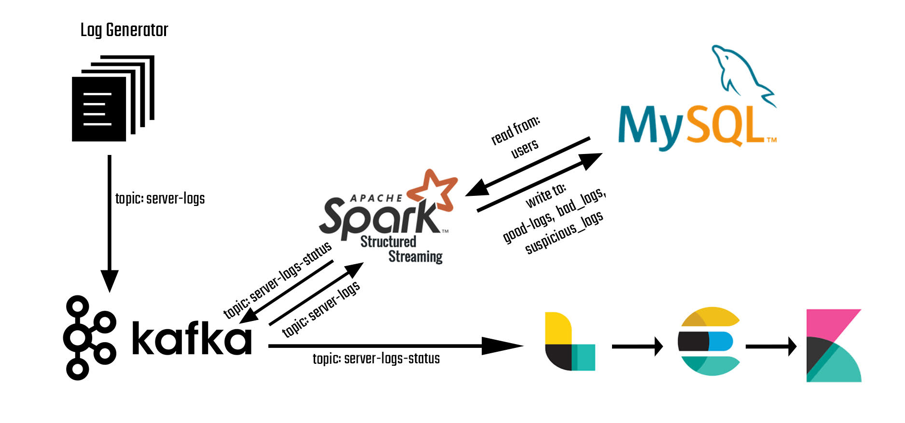
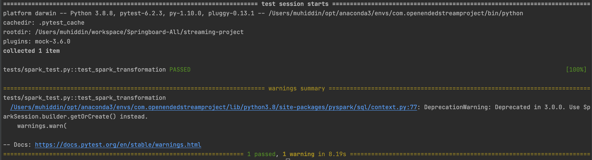
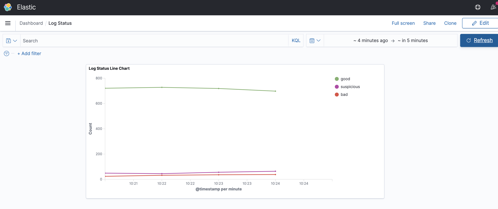

# STREAMING PROJECT: LOCAL VERSION

### **Building A Local Streaming Pipeline On MacOS**


## Introduction

>  In this project, we will create a local streaming pipeline backed by **Apache Kafka**, **Apache Spark and ELK Stack** using a **Python** client. 
>
>  What we'll build is a log generator and processor. We will generate a stream of logs and then we will write a PySpark script to process those stream of logs to categorize logs: goods, bad and suspicious. We will use data completeness together with consistency with a dimensional user table in MySql as our criteria. Let's look into our design:
>
>  

* Fields of a log:

  

* Our log generator will send the logs to server-logs topic in Kafka.

* Spark Structued Streaming will read these messages in realtime and will split the micro batches into 3 categories:

  - **bad_logs**: If logs are not following our desired data type schema or if they embed a null value in any field. 
  - **suspicious_logs**: We compare log's device type against the user's default device type in our **users** table in MySQL dim_users database. If they don't match we label the log as suspicious. We do this by joining micro batch with **users** dimensional table on **account_id** and **device** fields.
  - **good_logs:** If a log is not bad or suspicious, we label it as 'good'.


## PART A: Infrastructure

#### 1) Requirements

* Install Java 8

* We need to install Kafka, Spark (3.1), MySQL and ELK stack. We can utilize home brew to install required services on Mac OS. 

  ```basic
  brew install kafka
  brew install elasticsearch
  brew install logstash
  brew install kibana
  ```

* Install MySQL
* We need modules in [requirements.txt](./generator/requirements.txt) installed for our python execution environment.

#### 2) Configurations

+ For Kafka we need to configure server.properties.

  ```
  # Uncomment listener setting as:
  listeners=PLAINTEXT://localhost:9092
  ```

- For MySQL, I configured settings below. Feel free to change.
  - **Port**: 3306
  - **Username**: root
  - **Password**: root1234

* Don't forget to export KAFKA_HOME and SPARK_HOME path. I have added lines below to the ~/.bash_profile for zsh.

  ```
  export SPARK_HOME=/<local path to spark bin folder>/
  export KAFKA_HOME=/<local path to spark bin folder>/
  export PATH=$PATH:$KAFKA_HOME/bin
  export PATH=$PATH:$SPARK_HOME/bin
  ```

  

* We need to locate and edit **logstash_sample.conf** file in logstash config folder.  We can change the name of the conf file.

  ```yaml
  # logstash.conf
  # We read from a Kafka topic as input
  input {
      kafka {
              bootstrap_servers => "localhost:9092"
              topics => ["server-logs-status"]
      }
  }
  
  # We parse the original json message into fields, then filter out the original message
  filter {
        json {
          source => "message"
        }
  
        mutate {
          remove_field => [ "message" ]
        }
  
      }
  
  # We send the data to the 'server-logs' index in elastichsearch from where Kibana will read
  output {
     elasticsearch {
        hosts => ["localhost:9200"]
        index => "server-logs"
        workers => 1
      }
  }
  
  ```

  

### PART B: Testing

We are going to use pytest and pytest-mock modules to test our main transformation function in the spark script.

#### 1) Installing Packages

We need to install the packages of our application. We will create the ***setup.py*** file:

```python
from setuptools import setup, find_packages

setup(name="processor", packages=find_packages())

```

Then we will run this script to install the packages in ***develop*** mode:

```bash
python setup.py develop
```

#### 2) Creating Test Files

We need to create ***[conftest.py](./tests/conftest.py)*** file so that we can use fixtures for spark and sql contexts. Naming is important for this file.

```python
import logging
import pytest

from pyspark import HiveContext
from pyspark import SparkConf
from pyspark import SparkContext
from pyspark import SQLContext
from pyspark.streaming import StreamingContext
from pyspark import sql

def quiet_py4j():
    logger = logging.getLogger('py4j')
    logger.setLevel(logging.WARN)


@pytest.fixture(scope="session")
def spark_context(request):
    conf = (SparkConf().setMaster("local[2]").setAppName("pytest-pyspark-local-testing"))
    request.addfinalizer(lambda: sc.stop())

    sc = SparkContext(conf=conf)
    quiet_py4j()
    return sc

@pytest.fixture(scope="session")
def sql_context(spark_context):
    sql_context = sql.SQLContext(spark_context)
    return sql_context

```

Now we will create the test file ***[spark_test.py](./tests/spark_test.py)***. We will focus on testing the ***transform()*** function in our spark script. We will use mocker to mock the data we read from Kafka and MySQL.

```python
from processor import spark_processor as s
from pyspark.sql import SQLContext
from pyspark.sql.types import Row
from pyspark import sql
import datetime
import pytest

# Fixtures to use from conftest.py
pytest_mark = pytest.mark.usefixtures("spark_context", "sql_context")


def test_spark_transformation(spark_context, mocker):
    """ test that a single log is categorized correctly
    Args:
        spark_context: test fixture SparkContext
        sql_context: test fixture SqlContext
    """

    sqlContext = sql.SQLContext(spark_context)

    # Mocking the log coming from Kafka
    mocker.patch(
        'processor.spark_processor_refactored.read_from_kafka',
        return_value=spark_context.parallelize([Row(value='{"event_id": "141b3ff2a92111ebbfae367ddad5b1fa", '
                                                          '"account_id": "684", "event_type": "other", '
                                                          '"device": "ANDROID", "location_country": "FR", '
                                                          '"event_timestamp": "1619724510"}')]).toDF()
    )

    # Mocking the connection with MySQL
    mocker.patch(
        'processor.spark_processor_refactored.read_from_mysql',
        return_value=spark_context.parallelize([Row(account_no='684', user_device='ANDROID')]).toDF()
    )

    # Spark transformation result dataframe
    result = s.transform().collect()

    # Expected esult
    expected_result = [Row(event_id='141b3ff2a92111ebbfae367ddad5b1fa', account_id=684,
                           event_type='other', device='ANDROID', location_country='FR',
                           event_timestamp=datetime.datetime(2021, 4, 29, 12, 28, 30), status='good')]

    assert result == expected_result

```

#### 3) Running The Tests

In our test file, we test our ***transformation*** function for a ***"good"*** log. Let's run the test:

```bash
# Command to run all tests in the project subdirectories in debug and diff mode
pytest --pdb --vv
```

The test passes, which means our transformation function correctly categorized the server log we passed in the test file. We can add more tests files for testing ***"suspicious"*** and ***"bad"*** logs.



### PART C: Execution ###

#### 1) Running The Pipeline

Firstly we need to source our bash profile to export paths:

```
source ~/.bash_profile
```

Now we can get our pipeline going by running run the starter bash file ([run.sh](run.sh)). This bash file will start log generator and then immediately submit our processing PySpark script ([processor](./spark_processor.py)).

```bash
# After navigating to the project main folder:
bash run.sh
```


#### 2) Verify the results

- Firstly we need to check we have the topics created, if everything is okay, we are supposed to see **server-logs** and **server-logs-status** topics. If we see server-logs-status is in the topic list, it means our spark script works.

```bash
kafka-topics --list --zookeeper zookeeper:2181
```

* Then we can read messages in the console:

  ```bash
  kafka-console-consumer --bootstrap-server broker:9092 --topic server-logs --from-beginning
  kafka-console-consumer --bootstrap-server broker:9092 --topic server-logs-status --from-beginning
  ```

* We can check MySQL whether logs are being written into their respective tables.

* Now we can check Kibana (at port 5601) for new data, if it notifies that there is new data, then we create index pattern for our logs. Then we can build a simple realtime dashboard for log counts per category:

  

